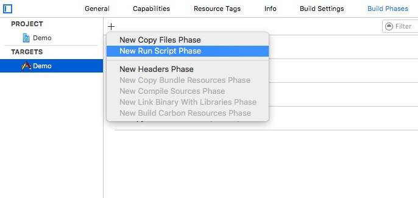
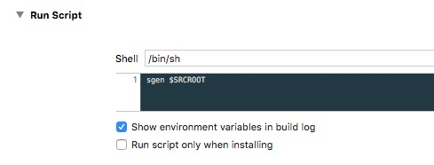
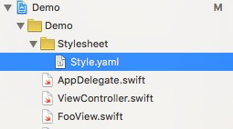
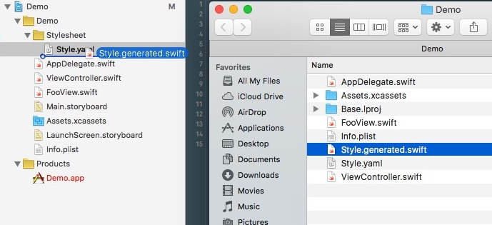

# S.swift

[](https://raw.githubusercontent.com/alexdrone/S/master/sgen)
[](#)
[](https://opensource.org/licenses/MIT)

_Get strong typed, autocompleted resources, color swatches and font styles in Swift projects (iOS or OSX) from a simple, human readable Yaml stylesheet_


**[S](#)** is inspired from *(and complementary to)* **[R](https://github.com/mac-cain13/R.swift)** and it is just a command line tool — *you don't have to import any framework in your project*!

## Overview

This:

```yaml

Color:
  blue: "#00ff00" #values can be colors, font, images, numbers or bool
  red: #properties can also have different values (when different conditions match)
    "horizontal = compact and idiom = phone": "#aa0000" 
    "default": "#ff0000"

Typography:
  small: Font(Helvetica, 12) #font (use System(-Weight*) or SystemBold as font names to use the system font)
  medium: Font(System-Semibold, 14)
  
FooView:
  background: $Color.red #properties can also redirect to other style's properties
  font: $Typography.small
  defaultMargin: 10
  textAlignment: Enum(NSTextAlignment.center)
  image: Image(myImage)
  aPoint: Point(10,10)
  aSize: Size(100,100)
  aRect: Rect(10,10,100,100)
  aEdgeInsets: Insets(10,10,100,100)

```
<sup>Check out Style.yaml in the Demo project to see more examples of property definitions. Many more constructs such as inheritance and extensions are available.</sub>

is transformed into a strongly typed, stylesheet in swift (**for brevity's sake only the interface of the generated code is shown below**)

```swift 

///Entry point for the app stylesheet
struct S {

    public static struct let Color: ColorAppearanceProxy
    public struct ColorAppearanceProxy {
        public var blue: UIColor { ... }
        public func redProperty(traitCollection: UITraitCollection? = default) -> UIColor
        public var red: UIColor { ... }
    }
    
    public static struct let Typography: TypographyAppearanceProxy
    public struct TypographyAppearanceProxy {
        public var small: UIFont { ... }
    }

    public static struct let FooView: FooViewAppearanceProxy
    public struct FooViewAppearanceProxy {
        public var margin: Float { ... }
        public var font: UIFont { ... }
        public var opaque: Bool { ... }
        public var textAlignment: NSTextAlignment { ... }
        public var image: NSImage { ... }
        public var aPoint: CGPoint { ... }
        public var aSize: CGSize { ... }
        public var aRect: CGRect { ... }
        public var aEdgeInsets: UIEdgeInsets { ... }
    }
}


```
<sup>**S** supports appearance proxy inheritance, properties override and extensions generation for your views. These are all different code-generation options that can be passed as argument to the generator. Check out Style.generated.swift in the Demo project.</sub>

You can access to a stylesheet property (in this example `Color.red`) by simply referring to as `S.Color.red` in your code.

The stylesheet supports colors, fonts, images, metrics and bools.

Like in the example shown above, **S** supports conditions for the value that take the screen size, the size class and the user interaction idiom into account.
(in this case `S.Color.red` is a different value given a different screen size/size class/idiom). See the stylesheet section for more info about it.


## Installation
*One liner.* Copy and paste this in your terminal.

```
curl "https://raw.githubusercontent.com/alexdrone/S.swift/master/sgen" > sgen && mv sgen /usr/local/bin/sgen && chmod +x /usr/local/bin/sgen 
```

The usage of the generator is as simple as 
```
sgen $SRCROOT
```

### Advanced usage

```
sgen PROJECT_PATH (--platform ios|osx) (--extensions internal|public) (--objc)

```

- `--platform [osx,ios]` use the **platform** argument to target the desired platform. The default one is **iOS**.
- `--objc` Generates **Swift** code that is interoperable with **Objective C** (`@objc` modifier, `NSObject` subclasses)
- `--appearance_proxy [internal,public]` Creates extensions for the views that have a style defined in the stylesheet. *public* and *internal* define what the extensions' visibility modifier should be.


## Adding S as a build script

You can integrate **S** in your build phases by adding it as a build script.

- Click on your **TARGET** abd go the **Build Phases** tab.
- Click on the **+** and select **New Run Script Phase** 



- Expand the **Run script** section
- Add `sgen $SRCROOT` in the script



- Now you can create your `.yml` stylesheet. Make sure it is placed inside your project source root (`$SRCROOT`)



- The first time you build your target (with `cmd + B`) drag the generated file inside the project. The generated swift file sits next to your stylesheet so, simply right click on your yaml stylesheet, select **Show in Finder** and drag the  `*.generated.swift` file inside your project



- Et voilà! Every time you will build your target the generated file will be updated as well.

## Stylesheet 

The following is the grammar for the YAML stylesheet.
Is supports simple values (bool, metrics, fonts, colors, images and enums), conditional values and redirects (by simply using $ + Section.key)

```yaml

SECTION_1:
  KEY: VALUE 	#simple value
  KEY: 			#conditional value
  	"CONDITION": VALUE
  	"CONDITION": VALUE
  	...
  	"default": VALUE	#every conditional value should have a 'default' condition
  KEY: VALUE

SECTION_2:
  KEY: VALUE
  KEY: $SECTION_1.KEY #redirect
  
SECTION_3 < SECTION_2: #this style inherits from another one
  KEY: VALUE
  KEY: $SECTION.KEY #redirect

```

The value part can be formed in the following ways:

```
	VALUE := COLOR | FONT | NUMBER | BOOL | IMAGE | ENUM | POINT | SIZE | RECT | EDGE_INSETS | REDIRECT
	COLOR := "#HEX" // e.g. "#aabbcc"
	FONT := Font(FONT_NAME(-WEIGHT)?, NUMBER) // e.g. Font(Arial, 12) or Font(System-Black, 14)
	WEIGHT := UltraLight | Thin | Light | Regular | Medium | Semibold | Bold | Heavy | Black
	IMAGE := Image(IMAGE_NAME) // e.g. Image(cursor)
	NUMBER := (0-9)+ //e.g. 42, a number
	BOOL := true|false
	ENUM := Enum(Type.Value)
	POINT := Point(NUMBER, NUMBER)
	SIZE := Size(NUMBER, NUMBER)
	RECT := Rect(NUMBER, NUMBER, NUMBER, NUMBER)
	EDGE_INSETS := Insets(NUMBER, NUMBER, NUMBER, NUMBER)
	REDIRECT := $SECTION.KEY //e.g. $Typography.small
```

A condition has instead the following form

```
	CONDITION := 'EXPR and EXPR and ...' //e.g. 'width < 200 and vertical = compact and idiom = phone'
	EXPR := SIZE_CLASS_EXPR | SIZE_EXPR | IDIOM_EXPR | CONTENT_SIZE_CATEGORY_EXPR
	SIZE_CLASS_EXPR := (horizontal|vertical)(=|!=)(regular|compact) // e.g. horizontal = regular
	SIZE_EXPR := (width|height)(<|<=|=|!=|>|>=)(SIZE_PX) //e.g. width > 320
	CONTENT_SIZE_CATEGORY_EXPR := category (=|!=) (xs|s|m|l|xl|xxl|xxxl|am|al|axl|axxl|axxxl) //e.g category = m
	SIZE_PX := (0-9)+ //e.g. 42, a number
	IDIOM_EXPR := (idiom)(=|!=)(pad|phone) //e.g. idiom = pad

```

## Credits

**S** uses [YamlSwift](https://github.com/behrang/YamlSwift) from *behrang* as Yaml parser
